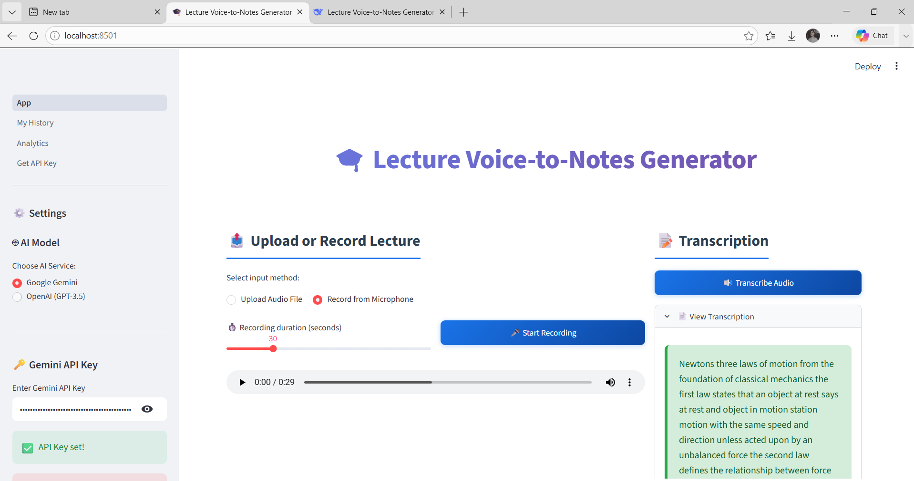
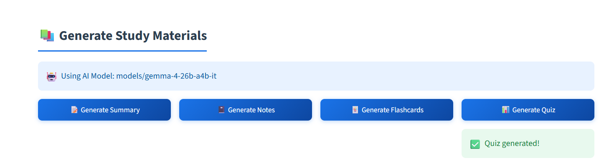
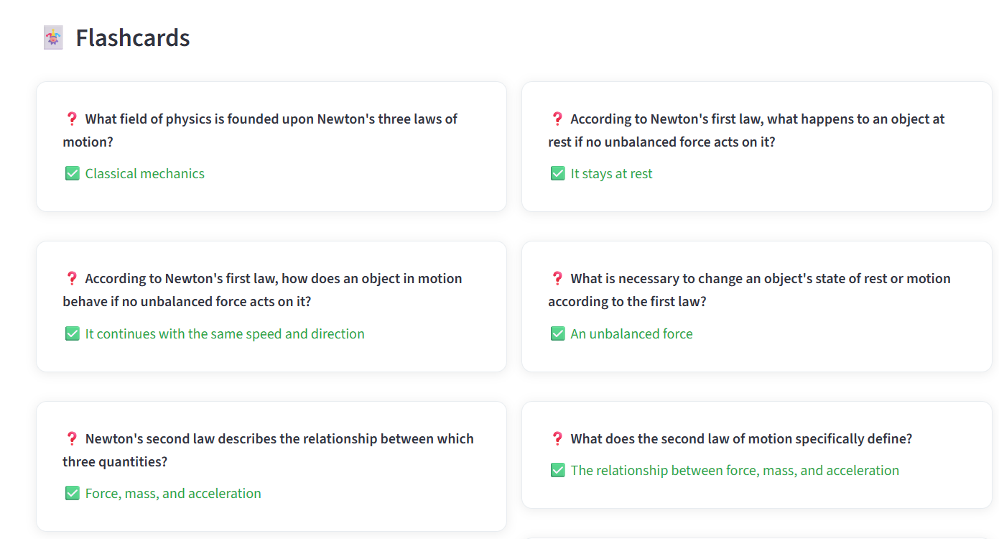
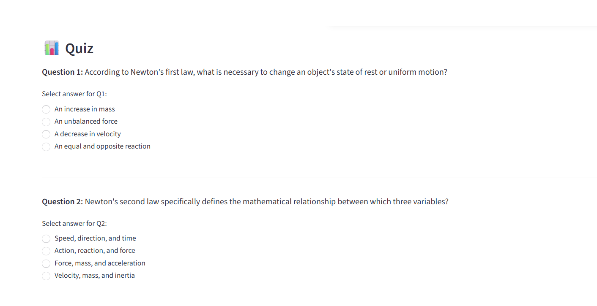

# 🎓 Lecture Voice-to-Notes Generator

[                                                         ](https://lecture-voice-to-notes-generator-ry5sgrwcpjectrndon2ysg.streamlit.app/)

An AI-powered web application that converts lecture audio into comprehensive study materials including summaries, notes, flashcards, and quizzes.

## ✨ Features

- 📝 **Transcription**: Convert speech to text using Google Speech Recognition
- 🤖 **AI-Powered Generation**: Create study materials using Google Gemini or OpenAI
- 📊 **Multiple Output Formats**:
  - 📝 Concise summaries
  - 📓 Structured study notes
  - 🃏 Interactive flashcards
  - 📊 Practice quizzes with scoring
- 🔐 **User Authentication**: Secure login/signup system
- 📚 **History Tracking**: Save and review previous lectures
- 📈 **Analytics Dashboard**: Track your learning progress
- 💾 **Download Options**: Export all materials as text files

## 🚀 Live Demo

Check out the live application: (https://lecture-voice-to-notes-generator-ry5sgrwcpjectrndon2ysg.streamlit.app/)

## 📸 Screenshots

### Main Dashboard

### Study Materials Generation

### Flashcards

### Quiz

## 🛠️ Tech Stack

- **Frontend**: Streamlit
- **Backend**: Python
- **AI/ML**: Google Gemini API, OpenAI API
- **Speech Recognition**: Google Speech Recognition
- **Database**: SQLite
- **Authentication**: bcrypt
- **Data Visualization**: Plotly, Pandas

## 📋 Prerequisites

- Python 3.9 or higher
- pip (Python package manager)
- Virtual environment (recommended)
- Google Gemini API key (free) or OpenAI API key

## 🔧 Installation

### 1. Clone the Repository
